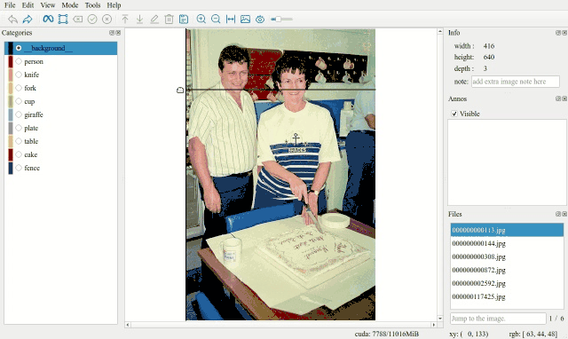

# ISAT with segment anything
# 交互式半自动图像分割标注工具



**如果这个项目给您的工作生活带来了便捷，请给一个Star；如果想对该项目贡献代码，请发Pull requests**


[[中文](README.md)]         [[English](./docs/README-en.md)]

集成[segment anything](https://github.com/facebookresearch/segment-anything)，实现图片分割快速标注。

演示视频：[bilibili](https://www.bilibili.com/video/BV1or4y1R7EJ/)

Demo Video：[youtube](https://www.youtube.com/watch?v=yLdZCPmX-Bc)

# 特点
- 支持基于SAM的**交互式半自动标注**。
- 支持**手动标注**多边形。
- 支持连点绘制，连点模式下每隔0.15s添加一个点，便于绘制曲线。
- 支持标注**二次修改**。
- 支持重叠目标**调整遮挡**关系。
- 支持标注**结果预览**。
- 单独线程进行sam encoder计算，降低切换图片的卡顿感
- 添加对[**segment-anything-fast**](https://github.com/pytorch-labs/segment-anything-fast)的支持，进一步提升sam编码效率
- 更多功能详见[功能说明](./docs/功能说明.md)

# 安装
## 1. 源码运行
### (1) 创建虚拟环境
```shell
conda create -n isat_env python=3.8
conda activate isat_env
```

### (2) 获取ISAT_with_segment_anything源码并安装依赖
```shell
git clone https://github.com/yatengLG/ISAT_with_segment_anything.git
cd ISAT_with_segment_anything
pip install -r requirements.txt
```
**windows系统下，通过pip安装的pytorch默认是cpu版本，gpu版本的pytorch需去[pytorch官网](https://pytorch.org/)手段安装。**
### (3) 下载Segment anything预训练模型
下载预训练模型，并将模型存放于ISAT_with_segment_anything/ISAT/checkpoints目录下

当前支持的模型有[SAM](https://github.com/facebookresearch/segment-anything)系列(支持[**segment-anything-fast**](https://github.com/pytorch-labs/segment-anything-fast)技术)，[sam-hq](https://github.com/SysCV/sam-hq)系列，[MobileSAM](https://github.com/ChaoningZhang/MobileSAM)系列。

**windows下，segment-anything-fast 需torch版本为2.2.0+dev，且需要安装其他依赖项，软件当前默认windows下不使用segment-anything-fast，等稳定版本推出后再进行更新。**
**如想提前进行使用，可参考[**segment-anything-fast**](https://github.com/pytorch-labs/segment-anything-fast)手动进行环境配置。**

| 系列 | 预训练模型 | 显存占用 | 文件大小 |
|----|----|----|----|
|    SAM     | [sam_vit_h_4b8939.pth](https://dl.fbaipublicfiles.com/segment_anything/sam_vit_h_4b8939.pth) | 7305M | 2.6G |
|            | [sam_vit_l_0b3195.pth](https://dl.fbaipublicfiles.com/segment_anything/sam_vit_l_0b3195.pth) | 5855M | 2.6G |
|            | [sam_vit_b_01ec64.pth](https://dl.fbaipublicfiles.com/segment_anything/sam_vit_b_01ec64.pth) | 4149M | 375M |
|   sam-hq   | [sam_hq_vit_h.pth](https://huggingface.co/lkeab/hq-sam/blob/main/sam_hq_vit_h.pth)           | 7393M | 2.6G |
|            | [sam_hq_vit_l.pth](https://huggingface.co/lkeab/hq-sam/blob/main/sam_hq_vit_l.pth)           | 5939M | 1.3G |
|            | [sam_hq_vit_b.pth](https://huggingface.co/lkeab/hq-sam/blob/main/sam_hq_vit_b.pth)           | 4207M | 379M |
|            | [sam_hq_vit_tiny.pth](https://huggingface.co/lkeab/hq-sam/blob/main/sam_hq_vit_tiny.pth)     | 1463M |  43M |
| mobile-sam | [mobile_sam.pt](https://github.com/ChaoningZhang/MobileSAM/blob/master/weights/mobile_sam.pt)| 1375M |  40M |

下载好模型后，重新启动软件，通过SAM-下拉列表，选择要用的模型。（切换模型需要一定时间，切换h模型大概需要5秒左右，视硬件情况而定。）

**目前软件提供了模型管理界面，由于sam-hq与mobile-sam的权重链接需要科学上网才可以访问。因而管理界面下载这两类模型会经常失败。有能提供国内比较好用的大文件托管服务，可以与我联系。**

### (4) 运行软件
```shell
python main.py
```

## 2. pip安装
### (1) 创建虚拟环境
```shell
conda create -n isat_env python=3.8
conda activate isat_env
```
### (2) pip安装ISAT_with_segment_anything
**windows系统下，通过pip安装的pytorch默认是cpu版本，gpu版本的pytorch需去[pytorch官网](https://pytorch.org/)手段安装。**
```shell
pip install isat-sam
```
### (3) 运行软件
```shell
isat-sam
```

## 3. windows下exe运行
### (1) 下载打包好的exe文件
**打包的exe版本会落后于git源码，建议运行源码或pip安装**

需下载三个.zip文件，总体大小2.7G，解压缩后4.9G。

打开ISAT_with_segment_anything文件夹，双击main.exe运行。

|        | 下载链接                                                      |
|--------|-----------------------------------------------------------|
| 百度网盘   | 链接：https://pan.baidu.com/s/1vD19PzvIT1QAJrAkSVFfhg 提取码：ISAT |

### (2) 下载Segment anything预训练模型

打包后的软件，附带了sam_hq_vit_tiny.pth模型，便于直接使用。 ( **近期有朋友反馈，sam_hq_vit_tiny.pth无法在CPU环境下运行，这是由于sam-hq模型权重保存的问题。请下载mobile-sam.pt权重后选择mobile-sam模型** )

如需使用精度更高的模型，请自行下载，并放置于ISAT/segment_any下(打包的exe为旧版本，还未更新)。

下载地址同上[下载预训练模型](https://github.com/yatengLG/ISAT_with_segment_anything/#3-下载segment-anything预训练模型)

# 使用
软件具体功能可查看：[功能说明](./docs/功能说明.md)
## 1.标注
```text
1. 软件左侧选择类别（工具栏-文件-设置中，进行类别添加或修改）
2. 开始标注
    2.1 半自动标注
        点击工具栏[Segment anything]开始半自动标注（快捷键Q）
        通过鼠标左键（或右键）提示感兴趣区域（或不感兴趣区域），调整目标分割掩码。
    2.2 手动标注
        点击工具栏[绘制多边形]开始手动标注（快捷键C）
        通过鼠标左键添加多边形顶点。
        鼠标左键按下并拖动，持续添加顶点，时间间隔0.15s。
    2.3 退上一个状态
        工具栏点击工具栏[回退]按钮（快捷键Z），回退到标注的上一个状态。
        半自动标注时，删除上一个添加的点提示；手动标注时，删除上一个添加的顶点。
3. 点击工具栏[标注完成]按钮，完成标注（快捷键E）。
4. 点击工具栏[保存]按钮（快捷键S），写入json文件。
```
## 2.修改
```text
1. 多边形修改
    拖拽多边形顶点，修改多边形形状。
    拖拽多边形，调整多边形位置。
2. 类别修改
    选定目标，点击工具栏[编辑]按钮（快捷键E），在跳出的编辑框中修改类别或添加信息。
3. 遮挡修改
    对于存在重叠部分的目标，选定目标多边形后，点击工具栏[置顶]（快捷键T）或[置底]（快捷键B）按钮，调整目标遮挡关系。
4. 删除目标
    选定目标，点击工具栏[删除]按钮（快捷键DEL），删除选定目标。
```
## 3.查看
```text
1. 结果预览
    点击工具栏[位图]按钮（快捷键SPACE），预览标注结果。
    点击时，以 ‘标注-语义-实例’ 的顺序进行切换。
2. 窗口调整
    点击工具栏[放大]，[缩小]，[适应窗口]（快捷键F）调整图片大小。
3. 显示/隐藏目标
    点击工具栏[显示/隐藏]按钮（快捷键V），显示或隐藏当前已标注目标。
    也可以在右侧标注栏中，通过勾选框显示/隐藏单个目标。
4. 背景清晰度调整（仅半自动标注时）
    半自动标注时，会调暗背景，凸显mask。
    通过工具栏[mask alpha]数值条，调整背景与mask混合比例。
```
## 4.数据转换
本软件用json文件保存标注结果。
使用时，可以手动解析json文件，或转换为其他数据格式。
```text
软件内置了转换工具
1. ISAT转VOC
    转换ISAT格式json为png单通道图片。语义分割中，像素值为类别index；实例分割中，像素值为实例id（软件中的group id）。
2. ISAT转COCO
    转换ISAT格式json为COCO格式json。（转换后，会丢失图层信息，如最终使用coco格式，标注时尽可能避免目标重叠）
3. ISAT转LABELME
    转换ISAT格式json为labelme格式json。（转换后，会丢失图层信息）
4. COCO转ISAT
    转换COCO格式json为ISAT格式json。
```

# Star History

**请给该项目一个star，您的点赞就是对我最大的支持与鼓励**
[](https://star-history.com/#yatengLG/ISAT_with_segment_anything&Date)

# 核心贡献者

<table border="0">
<tr>
    <td>
    <td>
    <td>...
</td>
</tr>
<tr>
  <td><a href="https://github.com/yatengLG">yatengLG</a>
  <td><a href="https://github.com/Alias-z">Alias-z</a>
    <td><a href="https://github.com/yatengLG/ISAT_with_segment_anything/graphs/contributors">...</a>
</tr>
</table>


# 引用
```text
@misc{ISAT with segment anything,
  title={{ISAT with segment anything}: Image segmentation annotation tool with segment anything},
  url={https://github.com/yatengLG/ISAT_with_segment_anything},
  note={Open source software available from https://github.com/yatengLG/ISAT_with_segment_anything},
  author={yatengLG, Alias-z and horffmanwang},
  year={2023},
}
```
