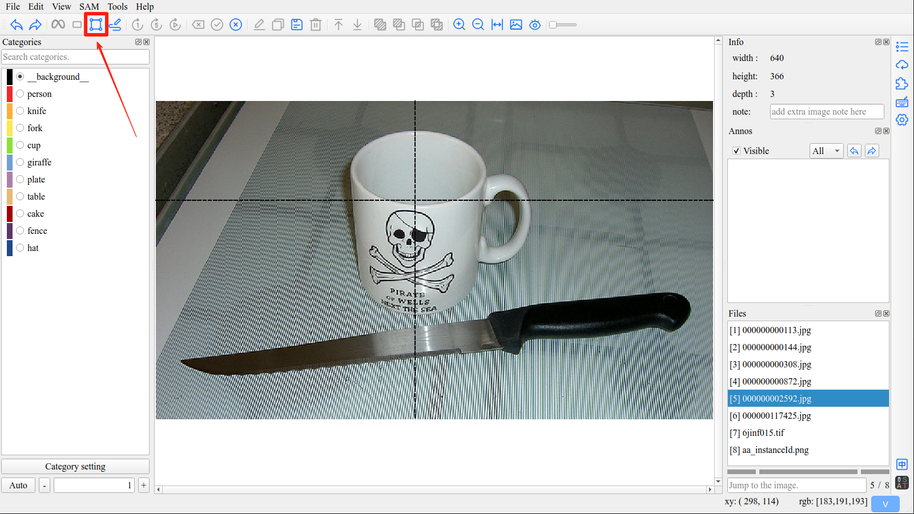
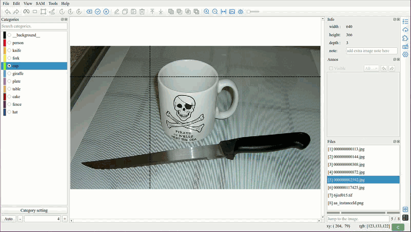
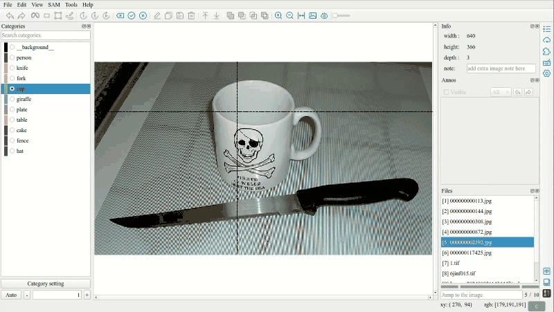
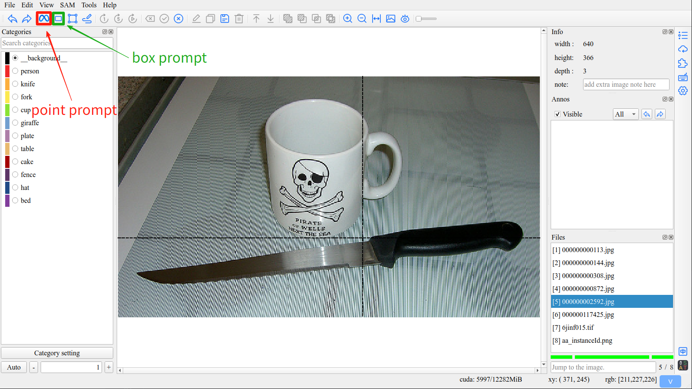
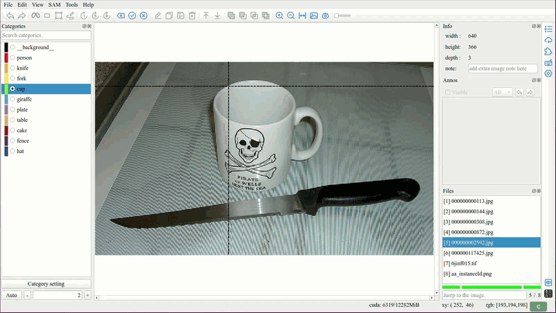
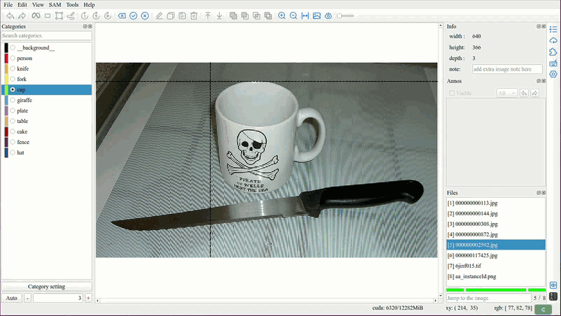

Annotate
=================================

1. Start Annotation
---------------------------------

1.1 Manual Annotation
,,,,,,,,,,,,,,,,,,,,,,,,,,,,,,,,,

Click the ``Draw Polygon`` button ``[C]`` in the toolbar to start manually annotating a polygon.

**Manual annotation offers two methods: clicking and dragging.**

1.1.1 Clicking Method
.................................

Clicking is the most common annotation method, with each click adding a polygon vertex.

1.1.2 Dragging Method
.................................

By pressing and holding the left mouse button and dragging the mouse, (0.15s per point)

.. tip:: With the Dragging method, you can easily draw curves.

1.1.3 Shift Key Constraint
.................................

Hold the ``Shift`` key while drawing to constrain lines to horizontal, vertical, or 45-degree angles.

.. tip:: This feature is useful for annotating objects with regular shapes like buildings, documents, or signs. The line will automatically snap to the nearest 0°, 45°, 90°, 135°, or 180° direction.

1.2 Semi-automatic Annotation
,,,,,,,,,,,,,,,,,,,,,,,,,,,,,,,,,

Utilizes SAM with point and bounding box prompts.

1.2.1 Point Prompt
.................................

Click the ``Segment anything point`` button ``[Q]`` in the toolbar to start SAM point prompt.

1.2.2 Box Prompt
.................................

Click the ``Segment anything box`` button ``[W]`` in the toolbar to start SAM box prompt.

2. Finish Annotation
---------------------------------

Click the ``Finish annotation`` button ``[E]`` in the toolbar to end the annotation.

When using sam, finish annotation will convert the mask into a polygon on the canvas.

.. tip:: ISAT offers multiple conversion methods, which you can find in the settings interface.

         Contour mode:

             - External contours
             - Only max contour
             - All contours

         For detailed usage, please refer to `Contour mode <other.html#contour-mode>`_.

3. Cancel Annotation
---------------------------------

Click the ``Cancel annotation`` button ``[Esc]`` in the toolbar to end the annotation.

4. Backspace
---------------------------------

Click the ``Backspace`` button ``[Z]`` in the toolbar to return to the previous annotation state.

.. image:: ../../display/backspace.gif
    :alt: backspace.gif

5. Video Annotation
---------------------------------

ISAT uses SAM2 for video annotation, provides the functions of annotating the next frame, the next five frames, and the entire video.

.. image:: ../../display/video_annotation.gif
    :alt: video_annotation.gif

.. tip:: Video annotation process:

    - Select SAM2 or SAM2.1 model.
    - Start the video annotation with an already annotated frame.
    - Click the ``Video segment once`` button or ``Video segment five times`` button or ``Video segment`` button.

