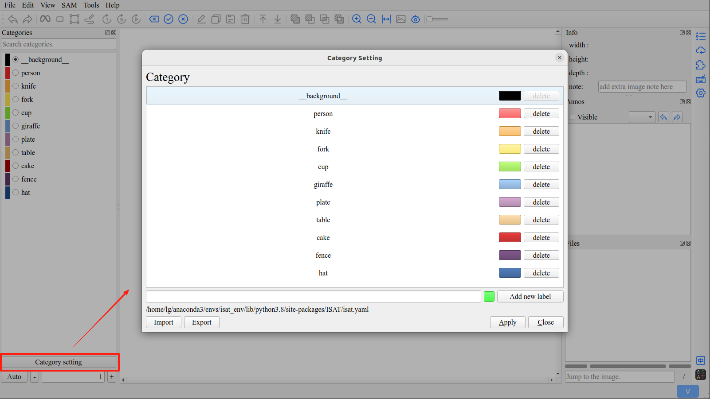
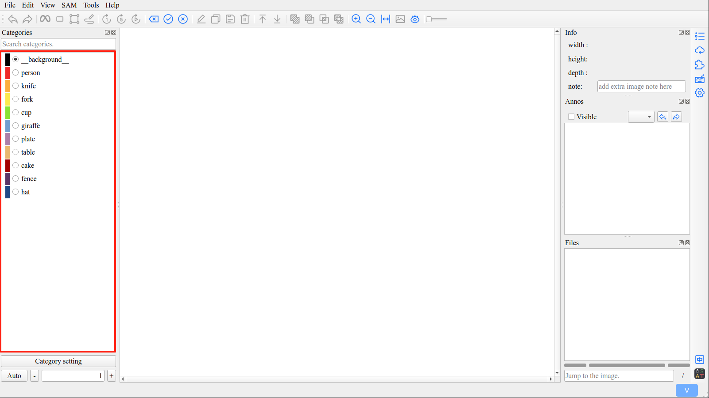
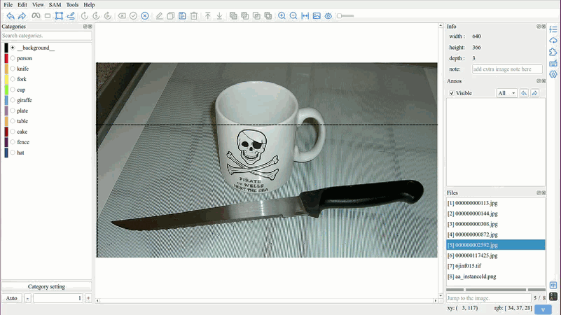

Category Setting
=================================

1. Category Setting
---------------------------------

In ISAT, you can customize category names and their display colors.

Click the ``Category settings`` button to open the category settings interface.

.. tip:: The background category is not modifiable in ISAT.

2. Select Category
---------------------------------

Before starting the annotation, you need to select a category.

If the targets to be annotated belong to the same category,  it can save a lot of work.

2.1 Category Selection Shortcut
,,,,,,,,,,,,,,,,,,,,,,,,,,,,,,,,,

Numbers ``[1 - 9]`` are category selection shortcut keys, allowing you to quickly select the category.

2.2 Quickly Locate the Category
,,,,,,,,,,,,,,,,,,,,,,,,,,,,,,,,,

ISAT uses a fuzzy matching algorithm to locate the desired category from a large number of categories.

.. tip:: The shortcuts from 1 to 9 also apply to the filtered categories.

