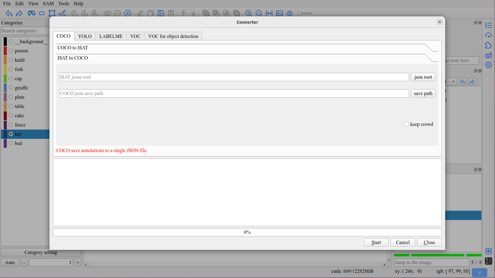

Export
====================================

1. ISAT Json Format
------------------------------------

..  code-block:: sh
    :linenos:

    {
        "info": {
            "description": "ISAT",                                      # Always ‘ISAT’ for the software to recoginize.
            "folder": "xxx/ISAT_with_segment_anything/example/images",  # The directory where the images are stored.
            "name": "000000002592.jpg",                                 # The name (path) of the image file.
            "width": 640,                                               # The dimensions of the image; depth is 3 for RGB images.
            "height": 366,
            "depth": 3,
            "note": ""                                                  # An optional field for any additional notes related to the image.
        },
        "objects": [                                                    # Object list.
            {
                "category": "table",                                    # The class label of the object.
                "group": 1,                                             # Instance id.
                "segmentation": [                                       # The vertices of a polygon composed of x and y coordinates.
                    [0.0, 168.0],
                    [0.0, 365.0],
                    ...
                ],
                "area": 223615.81705484597,                             # The area covered by the object in pixels.
                "layer": 1.0,                                           # Layer hierarchy
                "bbox": [0.0, 0.0, 639.0, 365.0],                       # The bounding box coordinates in the format [x_min, y_min, x_max, y_max].
                "iscrowd": false,                                       # A boolean value indicating if the object is part of a crowd.
                "note": ""                                              # An optional field for any additional notes related to the annotation mask.
            },
            {
                "category": "cup",
                "group": 2,
                "segmentation": [
                    [276.0, 36.0],
                    [264.0, 39.0],
                    ...
                    ],
                "area": 32479.5,
                "layer": 2.0,
                "bbox": [223.0, 34.0, 430.0, 244.0],
                "iscrowd": false,
                "note": ""
            },
            ...
        ]
    }

2. Export as Common Data Formats.
------------------------------------

Click ``Converter`` button in Tool in Menu bar to open Converter interface.

.. tip:: ISAT provides the conversion functionality between the following data formats:

     - ISAT <==> COCO
     - ISAT <==> YOLO
     - ISAT <==> LABELME
     - ISAT ===> VOC
     - ISAT ===> VOC(object detection)

