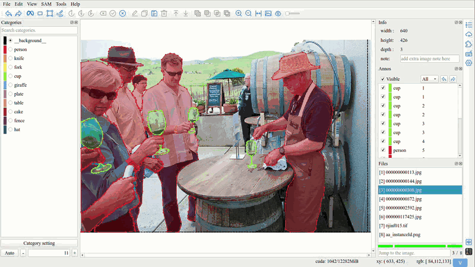

Inspect
=================================

1. Preview Annotation Result
------------------------------------

Click ``Bit map`` button ``[Space]`` in toolbar to preview semantic and instance annotation results.

2. Quick Browsing
------------------------------------

Select a group ID from a dropdown to view the target, supporting quick switching between different groups via the scroll wheel.

3. Detail Inspection
------------------------------------

Click ``Prev group`` button ``[~]`` or ``Next group`` button ``[Tab]`` to switch annotations one by one using group IDs, adapting the view to the size of the annotation for detailed inspection.

