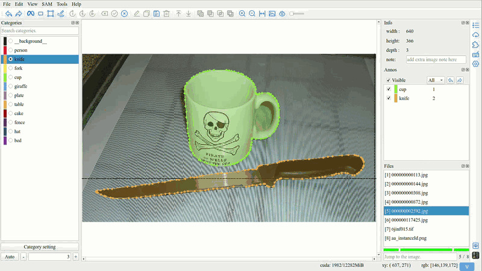
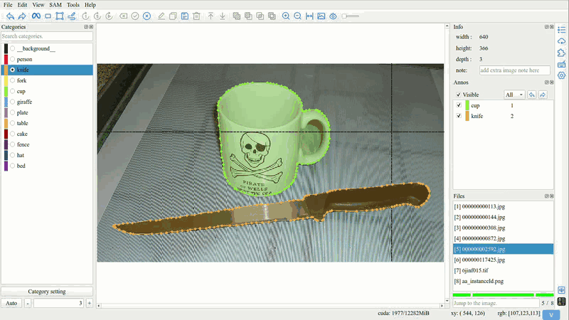

Modify
=================================

1. Move and Delete
---------------------------------

You can move or delete polygons and their vertices.

.. image:: ../../display/move_and_delete.gif
    :alt: move_and_delete.gif

.. tip:: Multiple selection is supported.

2. Edit
---------------------------------

Double click polygon or annotations list to open edit interface

.. image:: ../../display/edit.gif
    :alt: edit.gif

3. Repaint
---------------------------------

.. image:: ../../display/repaint.gif
    :alt: repaint.gif

.. tip:: Repaint process:

         - Click the ``Repaint`` button to switch to repaint mode.
         - Click on a vertex of polygon to start repaint.
         - Click on another vertex of polygon to end repaint.

4. Adjust the Layer
---------------------------------

.. tip:: Adjust the occlusion status of objects by changing the layer order.

5. Intersection, Union, Difference, and XOR
-------------------------------------------

- **Intersection**

- **Union**

- **Difference**

- **XOR (Symmetric Difference)**

.. tip:: Always use the attributes of the first polygon.

