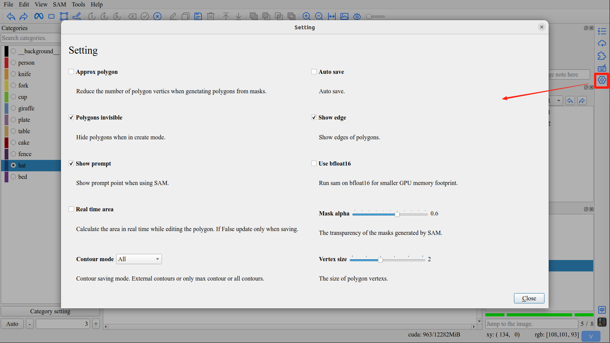
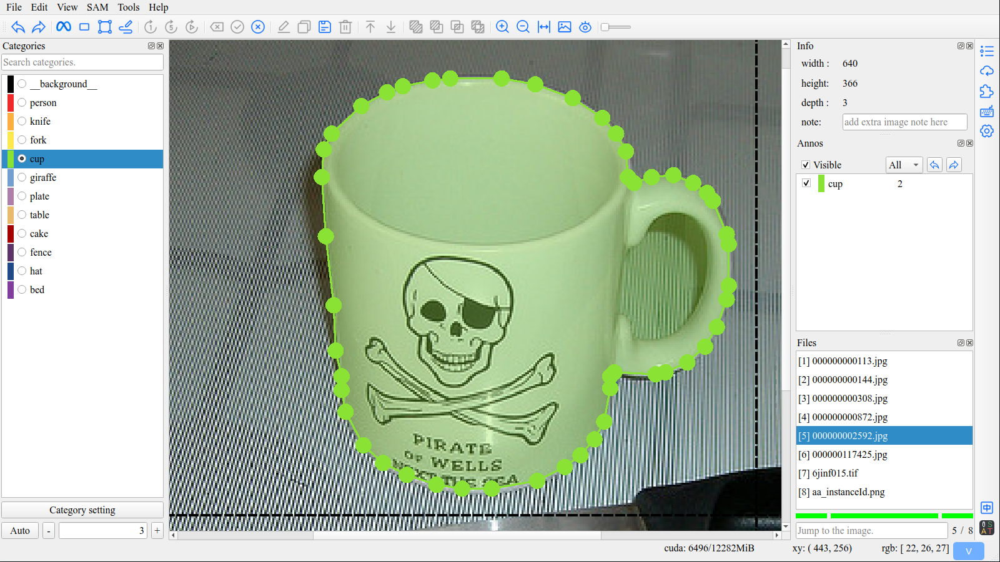
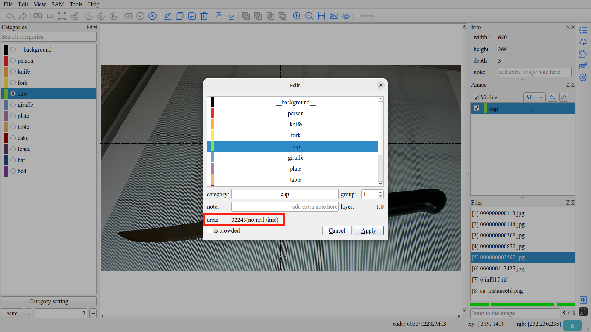
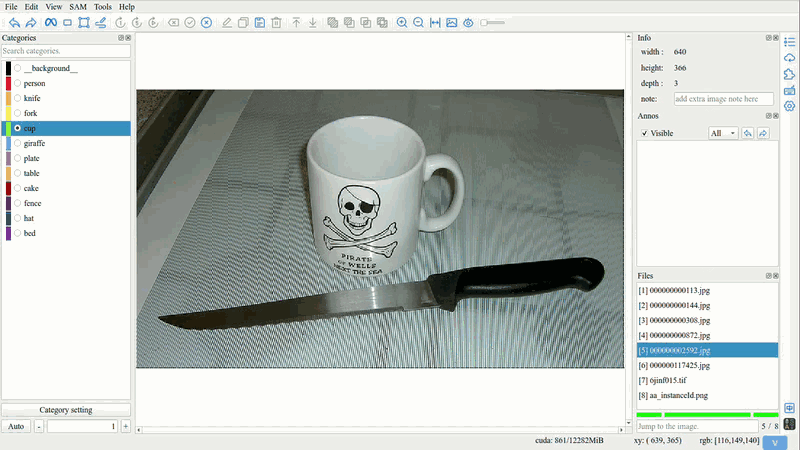
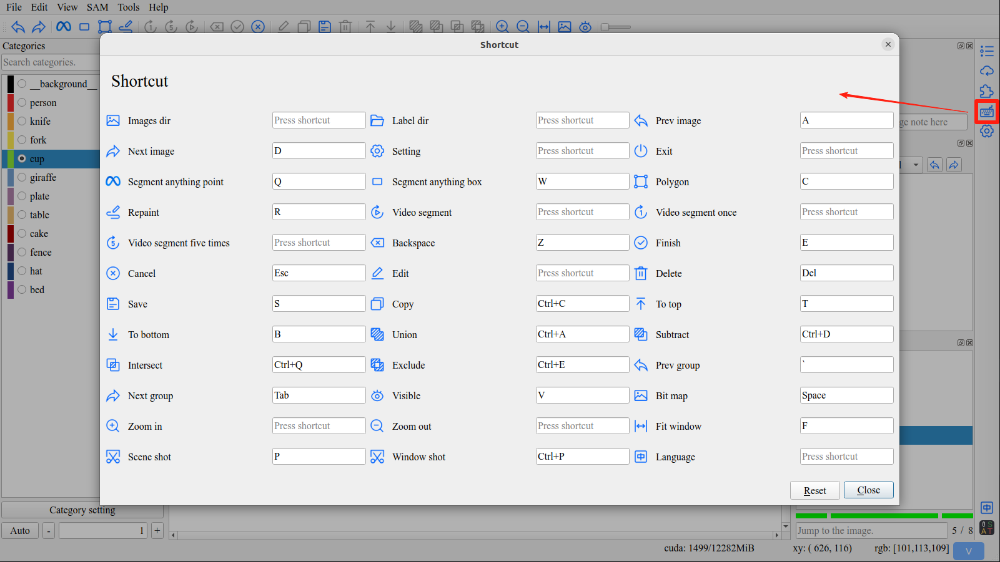
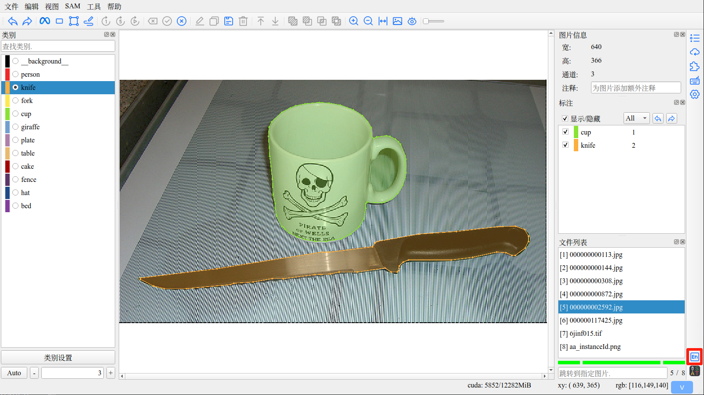

Other
====================================

1. Setting
------------------------------------

Click ``Setting`` button in right toolbar to open setting interface.

1.1 Approx Polygon
,,,,,,,,,,,,,,,,,,,,,,,,,,,,,,,,,,,,

Reduce the number of polygon vertics when genetating polygons from masks.

- **Enabled**

- **Disabled**

.. image:: ../../display/approx_polygon_disabled.png
    :alt: approx_polygon_disabled.png

1.2 Use Bfloat16
,,,,,,,,,,,,,,,,,,,,,,,,,,,,,,,,,,,,

Run sam on bfloat16 for smaller GPU memory footprint.

1.3 Real Time Area
,,,,,,,,,,,,,,,,,,,,,,,,,,,,,,,,,,,,

Calculate the area in real time while editing the polygon. If false update only when saving.

1.4 Mask Alpha
,,,,,,,,,,,,,,,,,,,,,,,,,,,,,,,,,,,,

The transparency ofthe masks generated by SAM.

1.5 Contour Mode
,,,,,,,,,,,,,,,,,,,,,,,,,,,,,,,,,,,,

- **External Contours**

.. tip:: Save all external contours.

- **Only Max Contour**

.. tip:: Save the largest contour.

- **All Contours**

.. tip:: Save all contours, setting the category of inner contours to __background__.

2. Shortcut
------------------------------------

Click ``Shortcut`` button in right toolbar to open shortcut interface.

.. tip:: You can customize all shortcuts to suit your own preferences.

3. Language Switching
------------------------------------

Click ``Language`` button in right toolbar to switch language.

.. tip:: The software provides two interfaces, Chinese and English, which can be switched at any time.

