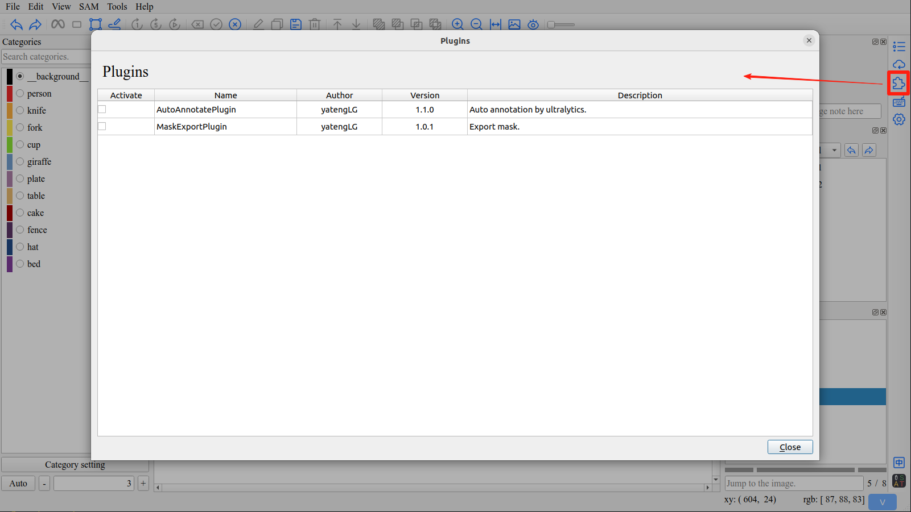

Plugin Usage
====================================

Install
------------------------------------

All ISAT plugins are released in the form of Python packages, you can quickly install it via the pip command.

For example to install the ``isat-plugin-mask-export``

.. code-block:: bash

       pip install isat-plugin-mask-export

.. important:: For specific plugin usage and installation, please refer to the instructions provided by the plugin. This should be provided in the page of the plugin project.

.. important:: After installing the plugin, click the reload button or restart ISAT to load the plugin.

For more plugins, please refer to the `plugin list <plugin_list.html#plugin-list>`_.

Usage
------------------------------------

Click ``Plugins`` button in right toolbar to open plugins interface, and then check the boxes of plugins you need to use.

.. warning:: Activating multiple plugins simultaneously may cause conflicts.
