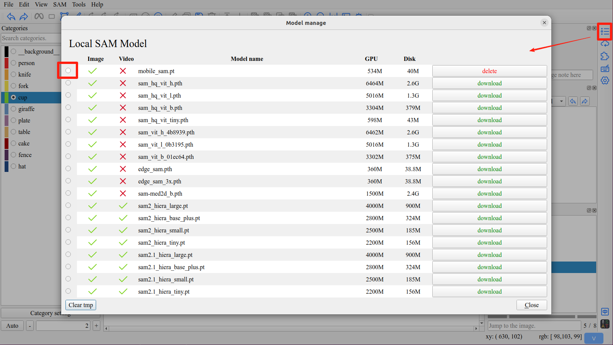
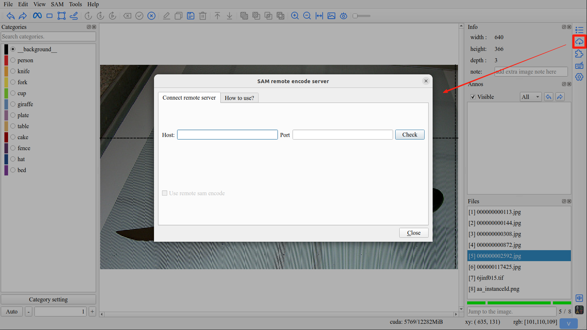
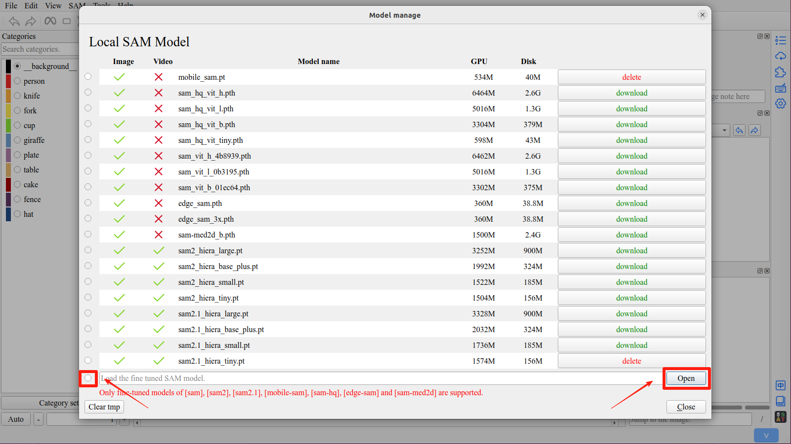

SAM Model
=================================

1. Manage SAM Model
---------------------------------

Click the ``Model manager`` button in the right toolbar to open the model manager interface

Download the required models, and click the radio button in front of the model list to activate the model.

2. Remote SAM
---------------------------------

Click the ``Remote SAM`` button in the right toolbar to open the remote sam interface

.. tip:: To use the remote sam, you must first install `ISAT with segment anything backend <https://github.com/yatengLG/ISAT_with_segment_anything_backend>`_ on the remote server.

         On the local machine, you also need to run the SAM model for decoding.

.. attention:: Currently, the entire SAM model needs to be loaded locally. In future updates, when using the remote SAM, only the decode part needs to be loaded locally. This work has not been completed yet.

.. danger:: The feature maps of Sam-hq model is too large. Do not use Sam-hq model on remote server.

3. Supported SAM Models
---------------------------------

.. list-table::
   :header-rows: 1

   * - Model
     - Checkpoint
     - Memory
     - Memory (bfloat16)
     - Disk
     - Image
     - Video

   * - SAM-HQ
     - sam_hq_vit_h.pth
     - 6464M
     - 3378M
     - 2.6G
     - yes
     - no
   * -
     - sam_hq_vit_l.pth
     - 5016M
     - 2634M
     - 1.3G
     - yes
     - no
   * -
     - sam_hq_vit_b.pth
     - 3304M
     - 1762M
     - 379M
     - yes
     - no
   * -
     - **sam_hq_vit_tiny.pth**
     - 598M
     - 392M
     - 43M
     - yes
     - no

   * - Mobile-SAM
     - **mobile_sam.pt**
     - 534M
     - 390M
     - 40M
     - yes
     - no

   * - Edge-SAM
     - edge_sam.pth
     - 360M
     - 304M
     - 39M
     - yes
     - no
   * -
     - edge_sam_3x.pth
     - 360M
     - 304M
     - 39M
     - yes
     - no

   * - MedSAM
     - sam-med2d_b.pth
     - 1500M
     - 1050M
     - 2.4G
     - yes
     - no

   * - SAM
     - sam_vit_h_4b8939.pth
     - 6462M
     - 3378M
     - 2.6G
     - yes
     - no
   * -
     - sam_vit_l_0b3195.pth
     - 5016M
     - 2634M
     - 1.3G
     - yes
     - no
   * -
     - sam_vit_b_01ec64.pth
     - 3302M
     - 1760M
     - 375M
     - yes
     - no

   * - SAM2
     - sam2_hiera_large.pt
     - 3252M
     - 2008M
     - 900M
     - yes
     - yes
   * -
     - sam2_hiera_base_plus.pt
     - 1992M
     - 1666M
     - 324M
     - yes
     - yes
   * -
     - sam2_hiera_small.pt
     - 1522M
     - 1226M
     - 185M
     - yes
     - yes
   * -
     - sam2_hiera_tiny.pt
     - 1504M
     - 1196M
     - 156M
     - yes
     - yes
   * - SAM2.1
     - sam2.1_hiera_large.pt
     - 3328M
     - 2266M
     - 900M
     - yes
     - yes
   * -
     - sam2.1_hiera_base_plus.pt
     - 2032M
     - 1682M
     - 324M
     - yes
     - yes
   * -
     - sam2.1_hiera_small.pt
     - 1736M
     - 1268M
     - 185M
     - yes
     - yes
   * -
     - sam2.1_hiera_tiny.pt
     - 1574M
     - 1194M
     - 156M
     - yes
     - yes
   * - SAM3
     - sam3.pt
     - 8600M
     - 8600M
     - 3.5G
     - yes
     - yes

.. tip:: If you are running ISAT on a cpu, it is recommended to use the **sam_hq_vit_tiny.pth** or **mobile_sam.pt** model.

4. Use fine tuned model
---------------------------------

Click the ``Open`` button in the the model manager interface to select the fine-tuned sam model.

.. important:: The supported fine-tuned models: **sam**, **sam2**, **sam2.1**, **sam3**, **mobile-sam**, **edge-sam**, **sam-hq** and **sam-med2d**.