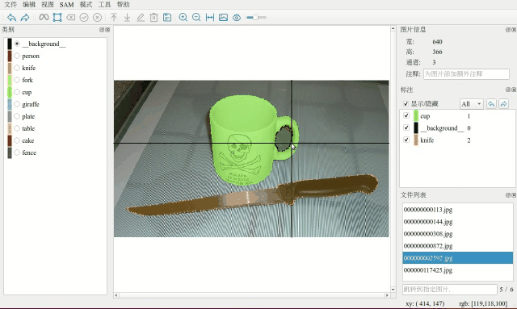
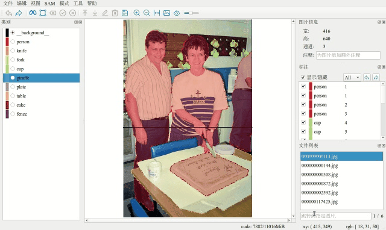

# 目录

1. [界面语言切换](https://github.com/yatengLG/ISAT_with_segment_anything/blob/master/docs/功能说明.md#1界面语言切换)
2. [模型切换](https://github.com/yatengLG/ISAT_with_segment_anything/blob/master/docs/功能说明.md#2模型切换)
3. [轮廓保存模式](https://github.com/yatengLG/ISAT_with_segment_anything/blob/master/docs/功能说明.md#3轮廓保存模式)
4. [遮挡关系调整](https://github.com/yatengLG/ISAT_with_segment_anything/blob/master/docs/功能说明.md#4遮挡关系调整)
5. [图片快速跳转](https://github.com/yatengLG/ISAT_with_segment_anything/blob/master/docs/功能说明.md#5图片快速跳转)
6. [状态栏信息](https://github.com/yatengLG/ISAT_with_segment_anything/blob/master/docs/功能说明.md#6状态栏信息)
7. [实时预览](https://github.com/yatengLG/ISAT_with_segment_anything/blob/master/docs/功能说明.md#7实时预览)
8. [配置文件导入导出](https://github.com/yatengLG/ISAT_with_segment_anything/blob/master/docs/功能说明.md#8配置文件导入导出)
9. [拖动绘制](https://github.com/yatengLG/ISAT_with_segment_anything/blob/master/docs/功能说明.md#9拖动绘制)
10. [快速浏览](https://github.com/yatengLG/ISAT_with_segment_anything/blob/master/docs/功能说明.md#10快速浏览)
11. [细节检查](https://github.com/yatengLG/ISAT_with_segment_anything/blob/master/docs/功能说明.md#11细节检查)
12. [顶点批量移动与删除](https://github.com/yatengLG/ISAT_with_segment_anything/blob/master/docs/功能说明.md#12顶点批量移动与删除)
13. [sam特征缓存](https://github.com/yatengLG/ISAT_with_segment_anything/blob/master/docs/功能说明.md#13sam特征缓存)
14. [模型管理](https://github.com/yatengLG/ISAT_with_segment_anything/blob/master/docs/功能说明.md#14模型管理)

# 1.界面语言切换
软件提供了中文与英文两种界面，可以随时切换。


# 2.模型切换
同时下载了多个模型，可以通过界面随时进行切换。


# 3.轮廓保存模式
使用SAM进行半自动标注时，具体流程是：mask -> 轮廓 -> polygon。
这里涉及了轮廓的保留策略。
1. 只保存最大轮廓
```text
针对存在多个轮廓的情况，只保留拥有最多顶点的轮廓。（通常是内包含面积最大的轮廓，此处节省了计算面积的步骤）
如果半自动标注时存在很多干扰，可以通过此模式，减少干扰，提升标注效率。
```
2. 只保存外轮廓
```text
保存所有外轮廓。
对于不需要进行镂空处理的数据时，用此模式。
```
3. 保存所有轮廓
```text
保存所有轮廓，包含内轮廓与外轮廓。内轮廓类别类别自动设置为背景类。
对于需要镂空的目标，可以使用此模式。
```


# 4.遮挡关系调整
对于存在重叠部分的目标，通过**置顶**或**置底**调整遮挡关系。




# 5.图片快速跳转
在文件下方输入框中，输入**图片名**或**序号**，可快速跳转到指定图片。



# 6.状态栏信息
在状态栏中，展示了鼠标所指像素在图片中的位置与像素值。
如果使用了半自动标注，也会实时显示显存占用。（显存整体的占用情况）
```text
cuda:显存占用。[当前显存占用]/[显存最大值]
xy: 像素位置。[x, y]
rgb: 像素值。三通道图片显示[r,g,b]；单通道显示[v]
```


# 7.实时预览
点击位图按钮，实时预览当前标注结果。
```text
切换顺序为[标注结果]-[语义预览]-[实例预览]。
语义预览时，相同类别目标具有相同的颜色。具体颜色与类别颜色相对应。
实例预览时，同一个目标具有相同颜色。（软件内置了255种差异较大颜色，group为256的实例与group为1的实例会具有相同颜色。）
```


# 8.配置文件导入导出
配置文件中保存了**类别**、**界面语言**、**轮廓模式**等信息，可以通过导入配置文件来快速配置类别；也可以导出当前配置文件。


# 9.拖动绘制
按住左键拖动鼠标，像绘图一样标注多边形，便于绘制曲线。


# 10.快速浏览
下拉选择，查看指定组id的目标，也可以通过滚轮，快速在不同组之间切换.


# 11.细节检查
以组id逐个切换目标，切换的同时，会自适应到目标大小，便于检查标注细节


# 12.顶点批量移动与删除
通过ctrl多选顶点，可以同时移动或删除多个顶点，即使他们不属于同一个多边形。


# 13.sam特征缓存
现在sam会在独立的线程中，进行encoder特征计算。所以切换图片没有卡顿感了ヾ(o◕∀◕)ﾉヾ

在文件列表前端，添加了特征缓存提示。
- 黄色:正在对该图片计算特征
- 绿色:该图片特征已计算并存储，可进行半自动分割
- 灰色:该图片没有计算特征图

缓存策略为缓存当前图片以及前后各一张图片的特征。（可在源码中进行更改，具体位置在widgets/mainwindow.py > SegAnyThread > run()函数中）


**当快速大量切换图片时，sam线程的计算速度可能会低于切换速度，导致当前图片特征并没有计算完成。这种情况只需重新点击图片或切换图片即可开始当前图片特征计算。**

# 14.模型管理


- 支持多线程同时下载多个模型
- 支持暂停与断点续传
- 添加模型国内下载链接(部分链接不支持断点续传)

**当前链接国内下载速度较慢，后续更新国内下载链接**
